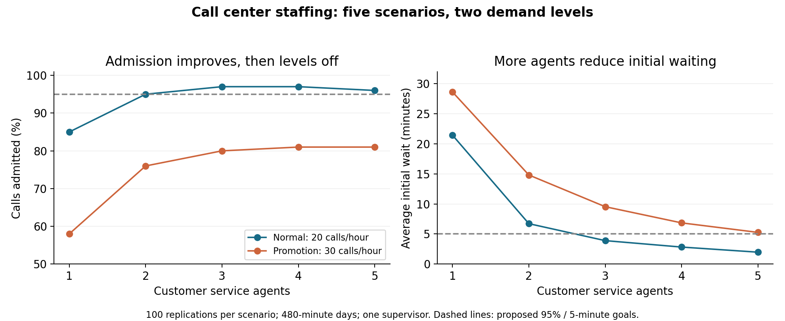

# Call Center Staffing Analysis with SimQuick

**Wesley Werner | Industrial Engineering, University of Missouri | ISE 2030**

I used a provided SimQuick model in Excel to compare call center staffing under normal demand and a promotional event. My goal was to understand how staffing, variability, and bottlenecks affect customer service.

## Main finding

Three customer service agents were a reasonable starting point for normal demand: **97% of calls were admitted** and the average initial wait was **3.90 minutes**. During the promotion, that setup fell to **80% admission** and **9.54 minutes** of initial waiting. Adding more agents helped waiting times, but the supervisor remained a bottleneck.

## Model and method

- Simulated call center: Dinner Time Call Services (DTCS).
- Five staffing scenarios: one through five customer service agents, each with one supervisor.
- Each scenario: 100 replications of a 480-minute day.
- Normal arrivals: `Exp(3)` minutes between calls, approximately 20 calls/hour.
- Promotional arrivals: `Exp(2)` minutes between calls, approximately 30 calls/hour.
- Agent service time: `Nor(3,2)` minutes; supervisor service time: `Nor(8,3)` minutes.
- 30% of calls require a supervisor; phone-line limit is 10.

The model and assignment were supplied for coursework. My contribution was running the demand comparisons, reviewing the outputs, interpreting utilization and blocked time, and recommending staffing changes.

## Results

All figures are reported overall means. Service level here means admission without a busy signal, rather than completion or answering within a time threshold. Initial waiting excludes additional waiting for the supervisor.

| Agents | Normal admission | Normal initial wait | Promotional admission | Promotional initial wait |
| --- | --- | --- | --- | --- |
| 1 | 85% | 21.43 min | 58% | 28.61 min |
| 2 | 95% | 6.72 min | 76% | 14.81 min |
| 3 | 97% | 3.90 min | 80% | 9.54 min |
| 4 | 97% | 2.83 min | 81% | 6.85 min |
| 5 | 96% | 1.98 min | 81% | 5.27 min |

My proposed goals were at least 95% admission and an average initial wait below five minutes. Three agents met both under normal demand. None of the tested promotional configurations met both goals.

## Bottleneck and recommendation

With three agents during the promotion, the supervisor worked 90% of the time. The agents were blocked 44%, 50%, and 53% of the time, showing that a low working percentage does not necessarily mean capacity is available.

At 30 calls/hour and a 30% referral rate, the expected supervisor workload is nine calls/hour if every call enters. An eight-minute average service time gives one supervisor capacity of approximately 7.5 calls/hour. This helps explain why more regular agents alone did not solve the problem.

I recommended three agents as a starting point for normal demand and testing **three agents with two supervisors** for promotional demand. The second-supervisor setup is a proposed follow-up, not a simulation I completed. Training agents to resolve more calls could also reduce referrals.

## Limits and next steps

The small differences between four and five agents should not be treated as proof that more agents hurt performance. The report contains means, without confidence intervals. A final staffing decision would also need labor costs, lost-call costs, customer expectations, peak-period demand, and the distribution of waiting times.

## Files

- [Analysis report (PDF)](reports/SimQuick-Analysis.pdf)
- [Editable report (Word)](reports/SimQuick-Analysis.docx)
- [Scenario results (CSV)](results/scenario-results.csv)
- [Original supplied model (Excel)](model/SimQuick-Call-Center.xlsm)

The saved model has an empty Results sheet and normal-demand arrival settings. The CSV and report preserve the completed results. The workbook is supplied unchanged; the model was not rerun while preparing this portfolio package. To run the VBA simulation, use desktop Excel with macros enabled for this trusted coursework file and follow the SimQuick instructions. GitHub previews the README and chart; download the workbook to inspect the model.

## Skills used

Discrete-event simulation, Excel, scenario analysis, queueing concepts, bottleneck identification, utilization analysis, and technical communication.

Source: ISE 2030 Assignment 2 model and instructions; results and interpretation from my October 1, 2026 analysis report.
